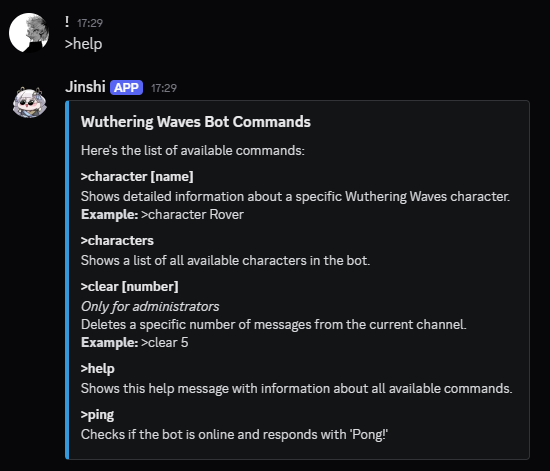
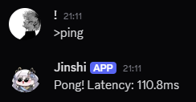
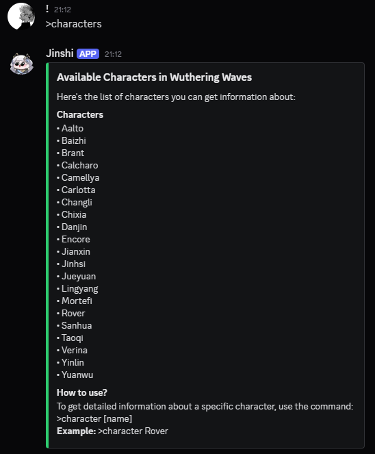
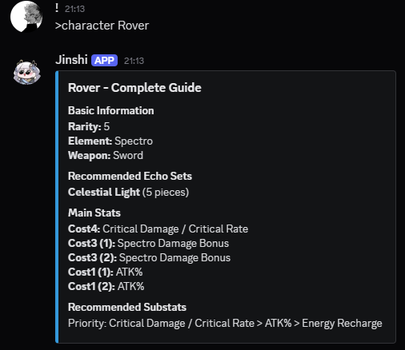

# Server User Command Guide

## >help
**Function:** Displays interactive help menu  
**Usage:** `>help`  
**Output:**  

## >ping  
**Function:** Checks bot latency  
**Usage:** `>ping`  
**Output:**  

## >characters  
**Function:** Lists available characters  
**Usage:** `>characters`  
**Output:**  

## >character [name]  
**Function:** Shows complete character sheet  
**Example:** `>character Rover`  
**Output:**   

## >clear [number]
**Function:** Deletes messages (admins only). Will delete specified messages and then show a confirmation message with the count of deleted messages (this message will auto-delete after a few seconds)  
**Usage:** `>clear 10`  
**Output:**  
